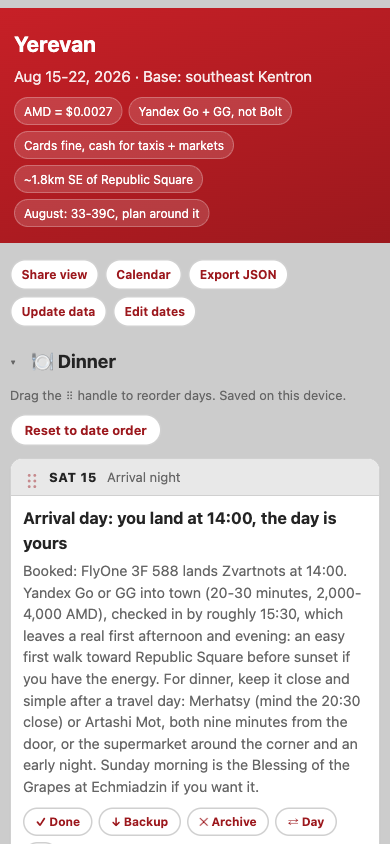
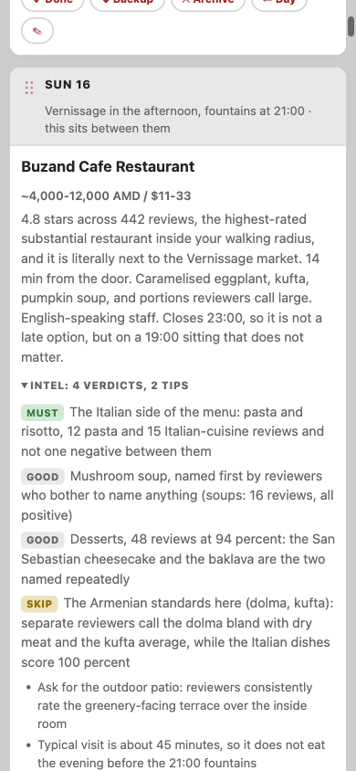
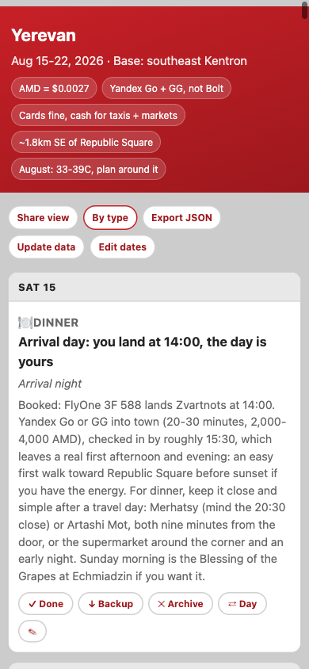

# CityOps

**A living city guide you operate, not just read.**

[](https://github.com/robriggs3/cityops/actions/workflows/test.yml)


[](LICENSE)

AI engines produce good city research in minutes, but the output is a wall
of text you re-scroll all week while the real trip mutates around it:
plans reorder, options die ("full tonight"), backups get promoted, and
half the value is discovered on the ground. CityOps owns the layer between
AI research and the actual week: a guide with a working memory.

**Live app:** [cityops.robriggs.com](https://cityops.robriggs.com) ·
**Example guides:** [Yerevan](https://cityops.robriggs.com/yerevan.html)
(currently being lived in) and
[Batumi](https://cityops.robriggs.com/batumi.html) (the field-tested
original) · **Deep dive:** [docs/ARCHITECTURE.md](docs/ARCHITECTURE.md)

| Planner | Review-verified intel | Calendar view |
|---|---|---|
|  |  |  |

## What it does

- **One file per city, or one app for all of them.** A guide is a single
  self-contained HTML file: opens from a bookmark, works offline, installs
  to a phone home screen. The hosted app wraps the same engine with a city
  switcher, profiles, and cross-device sync, and can export any city back
  to a standalone file: your data always has an exit.
- **A lifecycle, not a list.** Every place is `plan`, `backup`, `done`, or
  `archived`, with one-tap moves and undos. Days are chronological slots;
  drag a day's content elsewhere and the dates stay put while the plan
  reorders. Rename items, collapse sections, flip to a merged calendar
  view; everything persists.
- **AI-native, at zero marginal cost.** The app assembles complete
  research prompts (city, dates, your interest profile, an output
  contract) for your own Claude/ChatGPT session, then merges the returned
  JSON with hard guarantees: existing items and your progress are never
  overwritten. The app itself makes no AI calls and has no API bill.
- **Review-verified intel.** Cards carry `must / good / skip` verdicts on
  specific dishes and specifics-of-the-thing (which route, which seats,
  which add-on), plus tips and a source line. The shipped Yerevan guide
  includes a real pass: 25 items, 73 verdicts, built from per-dish review
  data, which corrected the guide's own prose in four places.
- **Local-first sync.** Optional magic-link login puts cities, progress,
  and your profile behind your account with row-level security. Offline
  and logged-out modes are fully functional; sync reconciles newest-wins
  when you reconnect.

## Quick start (no account, no install)

1. Copy `template.html` to `<city>.html` (e.g. `lisbon.html`).
2. Fill in the header of [`PROMPT.md`](PROMPT.md) with the city, dates,
   accommodation, and traveler profile, then paste the whole prompt into
   Claude, ChatGPT, or any capable AI engine. It returns a single JSON
   code block.
3. Get that JSON into the file, either way:
   - Paste it into the `<script type="application/json" id="city-data">`
     block in `<city>.html`, or
   - Save it as `cities/<city>.json` and run
     `node tools/embed.js cities/<city>.json <city>.html`.
4. Open the file. That's the whole guide: no build step, no server,
   offline once loaded, phone-friendly.

Or skip the file entirely: open the
[app](https://cityops.robriggs.com), tap the city name, **+ Add city**,
and either paste generated JSON or start a blank city from a name and
dates. **Build my prompt** assembles step 2 for you, with your saved
interest profile included.

## The workflow

Each place has a lifecycle: `plan` (the current pick), `backup` (the
alternative when plan A falls through), `done` (visited; recedes but
stays visible as the trip record), and `archived` (out of the way,
recoverable). One-tap controls move items between states; every move is
undoable, and controls only render where the action is valid.

Days render as chronological slot cards, including empty days, so
anything can be dragged or moved onto any date of the stay. **Share**
flips to a clean read-only view (prints as a one-pager). **Export**
downloads schema-valid JSON with your live changes baked in; the round
trip back through paste is lossless by test. **Update data** and
**Enrich** accept pasted JSON on the go: Update data replaces a city's
research wholesale, Enrich merges a delta (new interest matches, or an
intel pass) without touching anything you've done.

## Engineering notes, briefly

The short version of [docs/ARCHITECTURE.md](docs/ARCHITECTURE.md):

- ~2,000-line dependency-free engine + app shell, assembled into
  committed artifacts by a one-command assembler; CI fails if artifacts
  drift from source.
- Canonical data and live state never mix, which makes re-imports, AI
  deltas, and sync structurally unable to destroy user progress.
- Sync is Supabase over raw `fetch` (no SDK): magic-link auth, epoch-ms
  newer-wins reconcile, flush-on-hide, RLS-only security with anonymous
  access revoked and verified.
- The AI integration is a prompt contract: `PROMPT.md` doubles as
  documentation and machine-readable source, sliced by landmark into
  generated prompts; the merge path is validation-gated and
  prototype-safe.
- 107 tests on Node built-ins; the harness tests the exact bytes that
  ship. Every feature landed through a written spec, plan, and
  independent review (committed under `docs/superpowers/`), a workflow
  run with AI agents doing implementation and adversarial review under
  human product direction.

## Schema

Schema v1 is the contract across standalone guides, the app, exports, and
the generation prompt. The full reference lives in
[PROMPT.md](PROMPT.md)'s output contract and the specs; the shape in one
glance:

```json
{
  "schema": 1,
  "city": {"name": "Yerevan", "country": "AM",
           "dates": {"from": "2026-08-15", "to": "2026-08-22"}},
  "sections": [{"id": "dinner", "label": "Dinner", "icon": "🍽️"}],
  "items": [{
    "id": "buzand-cafe", "section": "dinner", "status": "plan",
    "day": "2026-08-16", "name": "Buzand Cafe Restaurant",
    "price": {"text": "~4,000-12,000 AMD / $11-33"},
    "note": "4.8 stars across 442 reviews ...",
    "hours": {"text": "10:00-23:00 daily", "class": "late"},
    "links": [{"kind": "map", "label": "Open in Maps", "href": "https://maps.google.com/?cid=..."}],
    "intel": {"verdicts": [{"tier": "must", "text": "The Italian side of the menu"}],
              "tips": ["Ask for the outdoor patio"],
              "source": "Yandex per-dish review data, Aug 2026"},
    "place_id": null, "verified": null
  }]
}
```

## Roadmap

Built and shipped in phases, each gated on evidence from real use:
single-file guides (phase 1), the multi-city app with sync and a custom
domain (phase 2), profiles + intel + delta enrichment (phase 3a). Next:
a bridge from the companion itinerary tracker (one tap scaffolds a city
from a trip stop), server-side enrichment when usage justifies the cost,
and Places-API verification. Full history in `docs/superpowers/`.

## License

MIT. The example city data is real, field-checked research; treat prices
and hours as snapshots of when they were verified.
